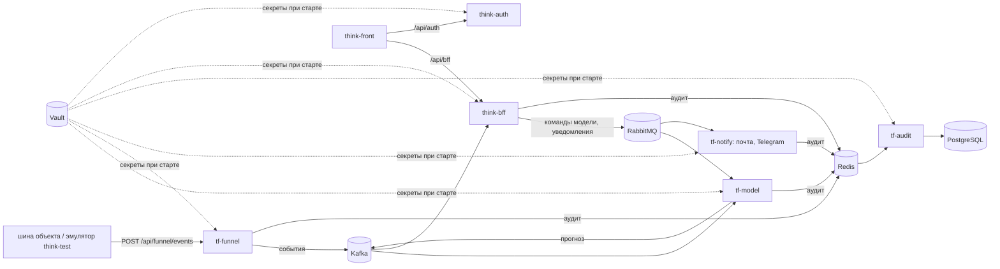

# think-test

Инструменты проверки стенда Think-Faster без настоящей шины объекта.

- **Эмулятор** проигрывает журнал событий датасета по текущему времени: те же 78 объектов и каналы,
  что в справочниках модели. Сервис приёма `tf-funnel` забирает у него поток пачками, поэтому модель,
  BFF и интерфейс работают так же, как на настоящих данных. Так устроен выставочный стенд
  [thinkfaster.ru](https://thinkfaster.ru).
- **Микротесты** за один запуск показывают, какой сервис стенда недоступен.

## Что где лежит

| Папка | Что внутри |
|---|---|
| [emulator](emulator) | эмулятор шины на Django: [engine.py](emulator/engine.py) — проигрывание журнала со сдвигом времени и правдоподобным разбросом значений, [views.py](emulator/views.py) — выдача событий и панель управления, [templates/panel.html](emulator/templates/panel.html) — панель |
| [emulator/data](emulator/data) | пример журнала событий, справочники каналов и объектов |
| [microtests](microtests) | [health.py](microtests/health.py) — проверка доступности сервисов стенда, [client.py](microtests/client.py) — вход и запросы, [config.json](microtests/config.json) — адреса ручек |

## Запуск

```bash
cd emulator
pip install -r requirements.txt
python manage.py runserver 8000
```

```bash
cd microtests
python health.py --base-url https://thinkfaster.ru --login <логин>
```

Код выхода `health.py`: 0 — всё доступно, 1 — что-то недоступно или вход не прошёл, 2 — не
прочитались параметры.

## Проект целиком

Think-Faster — сервис прогнозирования инцидентов в инженерных коллекторах (ЛЦТ-2026). Раз в час он
оценивает 78 объектов по журналу событий системы мониторинга и за сутки предупреждает о шести типах
происшествий: пожар, загазованность, подтопление, отказ оборудования, отказ датчика, проникновение.
К тревоге прилагаются основания и рекомендация: что сделать, в какой срок, кого послать. Решение
принимает диспетчер, сервис ничем на объекте не управляет.

| Что | Где |
|---|---|
| Прототип | [thinkfaster.ru](https://thinkfaster.ru) |
| Документация для экспертов: вход, архитектура, решения, методы, соответствие ТЗ, развёртывание, обзор | [think-infra/docs/project](https://github.com/Think-Faster/think-infra/tree/dev/docs/project) |
| Описание системы по сервисам | [think-infra/docs/system](https://github.com/Think-Faster/think-infra/tree/dev/docs/system) |
| Сопроводительная документация по ГОСТ 34.602, модель и исследование | [Think-Faster/docs/документация.md](https://github.com/Think-Faster/Think-Faster/blob/main/docs/документация.md) |

| Репозиторий | Что это | Стек |
|---|---|---|
| [Think-Faster](https://github.com/Think-Faster/Think-Faster) | модель прогноза, приём данных, уведомления, аудит; исследование, датасет, документация | Python, FastAPI, CatBoost, XGBoost, PyTorch; Go |
| [think-front](https://github.com/Think-Faster/think-front) | веб-интерфейс: диспетчер, главный диспетчер, инженер, администратор | React 19, TypeScript, Zustand |
| [think-bff](https://github.com/Think-Faster/think-bff) | API для интерфейса: права, группы, объекты, заявки, прогнозы, настройки модели | .NET 8, ASP.NET Core, EF Core, PostgreSQL |
| [think-auth](https://github.com/Think-Faster/think-auth) | вход и выпуск токенов RS256 | .NET 8, EF Core, PostgreSQL |
| [think-infra](https://github.com/Think-Faster/think-infra) | стенд: Vault, PostgreSQL, Kafka, RabbitMQ, Redis, nginx, почта, Telegram; выкатка | Docker Compose, Bash, GitHub Actions |
| [think-test](https://github.com/Think-Faster/think-test) | эмулятор шины объекта и проверка доступности стенда | Python, Django |



Код, который работает на [thinkfaster.ru](https://thinkfaster.ru): у think-front, think-bff и
think-auth — ветка `prod`; у think-infra — `prod`, документация — `dev`; у Think-Faster и think-test —
`main`.
